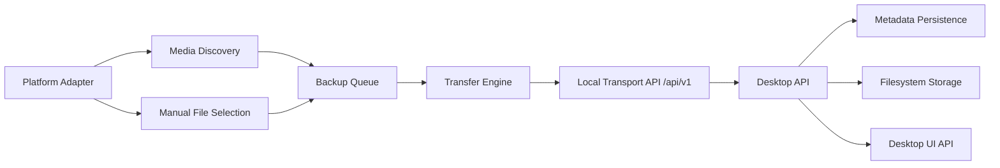

# Architecture

localSync uses platform-specific adapters around platform-neutral backup and transfer concepts.

## Conceptual Components

- Mobile/platform adapter: bridges native APIs into generic device, media, and transfer concepts.
- Media discovery: identifies source photos and videos eligible for automatic backup.
- Manual file picker: lets users select documents or arbitrary files for manual transfer only.
- Backup queue: tracks work to send without implying deletion propagation.
- Transfer engine: streams bytes, supports chunking/resume, and records upload progress.
- Transport protocol: versioned local-network API under `/api/v1/`.
- Device authentication/pairing: establishes trust before upload rights are granted.
- Desktop API: receives requests, validates sessions, and exposes backup state to UI.
- Metadata persistence: stores device, media, transfer, and backup metadata.
- Filesystem storage: stores actual media/files as normal files using temporary paths before finalization.
- Desktop UI: presents status and controls but does not own backup business rules.

## Platform Boundaries

Android-specific code lives under `android/` and uses Kotlin, Jetpack Compose, MediaStore, Room, Coroutines, OkHttp, and platform `NsdManager` for manual media backup and Phase 6 foreground locator discovery. WorkManager, background discovery, Storage Access Framework document transfer, and automatic backup remain future work.

Desktop-specific code will live under `desktop/` and may use FastAPI, SQLAlchemy, SQLite, Alembic, pytest, Uvicorn, Zeroconf/mDNS, React, TypeScript, and Vite.

The protocol and domain model must not use platform-specific names.



## Storage Model

Metadata persistence records identity, state, offsets, hashes, and backup records. Media and transferred file bytes remain normal filesystem files.

Uploads write to temporary or partial storage. A file becomes a successful backup only after completion checks pass, including expected size and SHA-256 verification.

Phase 3 resumable transfers use persisted `UploadSession` metadata plus server-generated partial files under `.localsync-temp`. The actual partial-file length is the authoritative accepted offset. The database offset is reconciled to filesystem reality before status, append, recovery, and completion operations.

Chunk appends are sequential and offset-based. The server accepts only chunks beginning at the authoritative partial length, so old-offset retries cannot duplicate bytes and future-offset requests cannot create holes.

## Deletion Safety

Automatic media backup does not mean synchronization. Source deletion is not a delete operation for laptop backup storage.

Any future deletion, cleanup, retention, or pruning feature must be explicit, user-controlled, and separately documented.

## Resumability

The transfer engine and protocol support sequential resumable uploads through `/api/v1/uploads`. A multi-gigabyte video interrupted partway through can resume from the accepted partial-file offset when the upload session row and partial file remain available.

Full SHA-256 is recomputed by reading the completed partial file during finalization. This avoids persisting implementation-specific hash state.

## Pairing and Authentication

Phase 5 introduces server-generated paired-device identities and opaque bearer credentials. The backend no longer treats client-supplied `device_id` as authorization proof for transfer APIs.

Phase 6 adds DNS-SD/mDNS advertisement through a backend discovery boundary and Android `NsdManager`. Discovery is locator-only: TXT metadata is advisory, the Phase 5 pinned SPKI identity remains authoritative, and Android updates only the current locator after a public pinned-TLS preflight. Discovered candidates are ephemeral and are not stored in Room or the backend database.

The desktop backend owns persistent local TLS identity under the configured data root, pairing-session lifecycle, paired-device credential verifiers and revocation state, authenticated-device route dependencies, and upload-session ownership checks.

Android owns local paired credential storage protected by Android Keystore-backed encryption, pinned server identity metadata, and authenticated OkHttp transfer requests.

The transfer protocol remains platform-neutral: Device, UploadSession, File, Backup, and Transfer.

## Android Client

The Phase 4 Android client is one application module with logical package boundaries:

```text
Compose UI -> ViewModel -> BackupRepository
    -> MediaStoreScanner
    -> AndroidMediaByteSource
    -> Room DAOs
    -> OkHttp localSync protocol client
```

The Android app scans accessible MediaStore images and videos only. It does not crawl filesystem paths, use `MediaStore.DATA`, request `MANAGE_EXTERNAL_STORAGE`, or calculate SHA-256 during inventory scans.

Manual Backup Now is a foreground user action. The app computes SHA-256 incrementally from the source `content://` bytes, checks the backend for existing content, creates or recovers a resumable upload session, streams bounded chunks with explicit offsets, and marks an item backed up only after the backend reports already-stored or completed status.

Room stores Android-side metadata and backup state only. Media bytes remain in MediaStore and final backup bytes remain normal filesystem files on the desktop backend.

Media permission state is modeled explicitly as unknown, denied, partial, or full. Partial access is never treated as proof that all phone media is protected.

## Assumptions

- The desktop/laptop acts as the initial backup receiver in V1.
- Local-network communication is the primary transport for V1.
- Pairing and authentication will be implemented before production upload endpoints are exposed.
